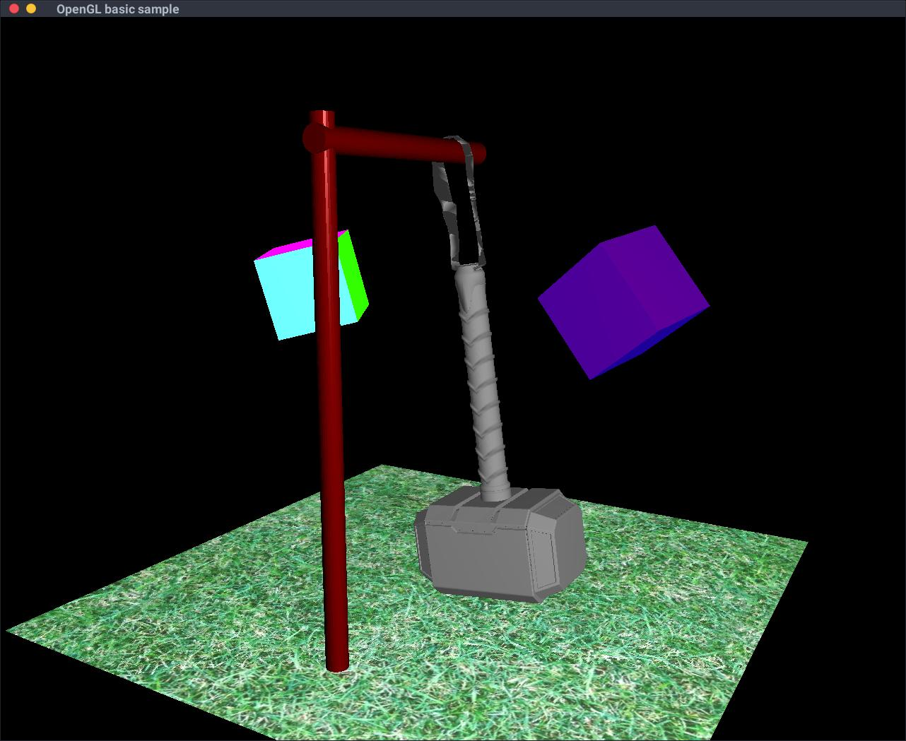

# OpenGL practice

Here I practiced in OpenGL and GLSL a little bit. This practice was performed as part of the 
"computer graphics" course in CMC MSU 6 semester. Written code based on template and was 
"practice code" so it doesn't claims to be "best code ever".

### Task 01 (Ray marching)

### Task 02 (Screensaver on top of OpenGL)

### Task 03 (Dynamic scene on top of OpenGL)

